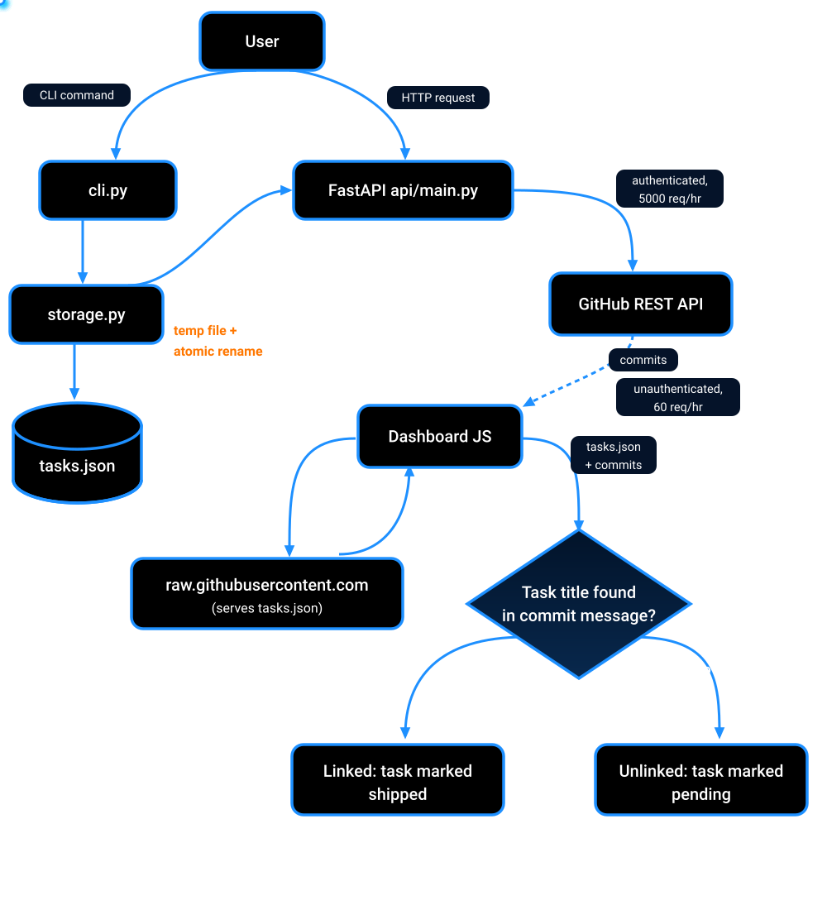

# DevTrack

A CLI-first task tracker that answers one honest question: **did the planned work actually ship?**

Tasks live in a flat local JSON file. A public dashboard cross-references them against real GitHub commit history, with no database, no required backend, and no vendor lock-in.


---

## Quick Start

```bash
python cli.py add "Write project README" --priority high --tags docs,polish --due-date 2026-09-01

python cli.py list --status pending

python cli.py update 3 --priority low

python cli.py complete 3

python cli.py remove 3
```

---

## How It Works

* Every task is matched against your repo's commit history in real time.
* If a commit message mentions the task, the dashboard links them.
* If there is no mention, the dashboard says so plainly. No inflated progress bars, no fake completion.
* The public dashboard has zero backend dependency. It reads `tasks.json` and commit data directly from GitHub's APIs (`raw.githubusercontent.com` + REST API), so it keeps working even when your laptop is off.
* An optional local FastAPI layer provides authenticated GitHub calls (5,000 req/hr vs. 60 unauthenticated) and full task CRUD over HTTP.
* The same `Task`/`Storage` logic serves both the CLI and REST API, with no duplication.
* Every save goes to a temporary file first, followed by an atomic OS-level rename. A crash mid-write cannot corrupt task data.
* Matching is a transparent substring check, not fuzzy or semantic matching, so you can always see exactly why a match happened.

---

## Data Flow



Toggle `USE_LOCAL_API` in `dashboard/js/config.js` to switch which path the dashboard takes.

---

## Architecture

```text
                         DevTrack

              ┌─────────────┴─────────────┐
              │                           │
             CLI                    Dashboard (JS)
        (cli.py, direct                    │
         to storage.py)          ┌─────────┴─────────┐
              │                   │                   │
              │             raw GitHub URLs      Local FastAPI
              │            (public, no backend    (optional,
              │                 needed)            dev-only)
              │                   │                   │
              └───────────────────┴──────────┬────────┘
                                             │
                                             ▼
                                       tasks.json
                                  (single source of truth,
                                     atomic writes)
```

---

## Features

### CLI & Task Management

* `add`, `list`, `update`, `complete`, `remove` - full lifecycle
* Priority (low/medium/high), tags, due dates, repo links

### Plan vs. Execution

* Dashboard cross-references tasks against live commit history
* Transparent substring matching, so you can see exactly why a match happened

### Dashboard

* Reads GitHub directly, with no server required to view
* Fetch-mode toggle: raw GitHub URLs or local API

### Reliability

* Atomic temp-file + rename writes, preventing corruption on crash
* 11 pytest cases covering `Task` and `Storage`, run on every push via CI

---

## Tech Stack

| Layer        | Technology                                    |
| ------------ | --------------------------------------------- |
| CLI          | Python, argparse                              |
| Core logic   | `Task`/`Storage` classes, JSON persistence    |
| Optional API | FastAPI, httpx, Pydantic                      |
| Dashboard    | Vanilla JavaScript (ES modules), no framework |
| Testing      | pytest, `tmp_path` fixtures                   |
| CI/CD | GitHub Actions (test-on-push) |
| Hosting      | GitHub Pages (dashboard), local-only (API)    |

---

## Project Structure

```text
devtrack/
├── cli.py                    # argparse CLI entry point
├── task.py                   # Task domain model
├── storage.py                # JSON persistence, atomic writes
├── status.py / priority.py   # Enums
├── tasks.json                # Data file
├── tests/                    # pytest suite
│
├── api/                      # Optional local FastAPI layer
│   ├── main.py
│   ├── core/                 # Settings, dependency injection
│   ├── routers/              # tasks + github endpoints
│   ├── schemas/              # Pydantic request/response models
│   └── services/             # GitHub API integration
│
└── dashboard/
    ├── index.html
    ├── css/style.css
    └── js/                   # fetch, render, merge logic
```

---

## Running the Optional Local API

```bash
python -m venv myenv && source myenv/bin/activate
pip install -e ".[dev]"
PYTHONPATH=.:./api uvicorn api.main:app --reload
```

Swagger UI: `http://localhost:8000/docs`

| Method | Endpoint                   | Description                    |
| ------ | -------------------------- | ------------------------------ |
| GET    | `/api/tasks/`              | List all tasks                 |
| POST   | `/api/tasks/`              | Create a task                  |
| PUT    | `/api/tasks/{id}`          | Partial update                 |
| POST   | `/api/tasks/{id}/complete` | Mark complete (idempotent)     |
| DELETE | `/api/tasks/{id}`          | Delete a task                  |
| GET    | `/api/github/repo`         | Repo summary (authenticated)   |
| GET    | `/api/github/commits`      | Recent commits (authenticated) |

---

## Running Tests

```bash
pytest -v
```

---

## Trade-offs

* Task-to-commit matching is a case-insensitive substring check, not fuzzy or semantic. This is a deliberate transparency tradeoff, not an oversight.
* No auto-commit tagging (e.g. `Closes #task-id`). Matching relies purely on title text overlapping commit messages.
* Single JSON file, no concurrent-writer protection. Fine for a personal single-user tool, but not multi-user safe.
* The unauthenticated public dashboard is subject to GitHub's 60 req/hr rate limit, mitigated locally via the optional FastAPI layer + token.

---

## Roadmap

| Item                                                            | Status  |
| --------------------------------------------------------------- | ------- |
| `pip install devtrack-cli` packaging                            | Planned |
| Auto-commit → task linking (`git commit -m "feat: x (task:3)"`) | Planned |
| Task search/filter in dashboard UI                              | Planned |

---

## License

MIT © 2026 Krish Ardeshna
